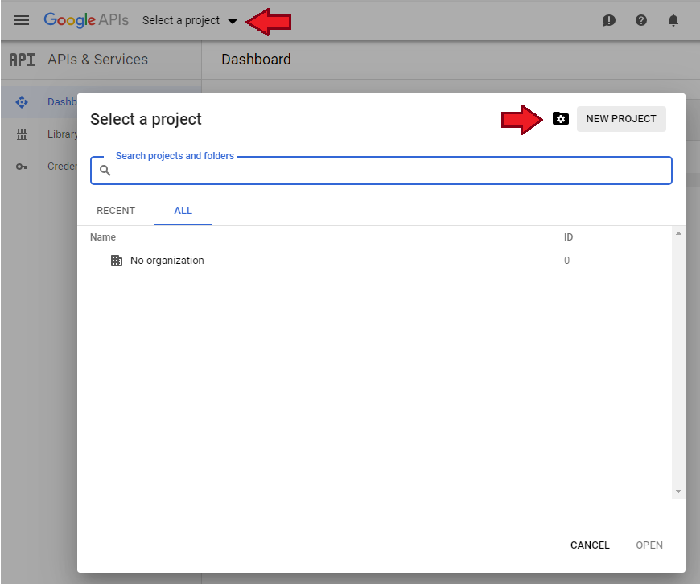
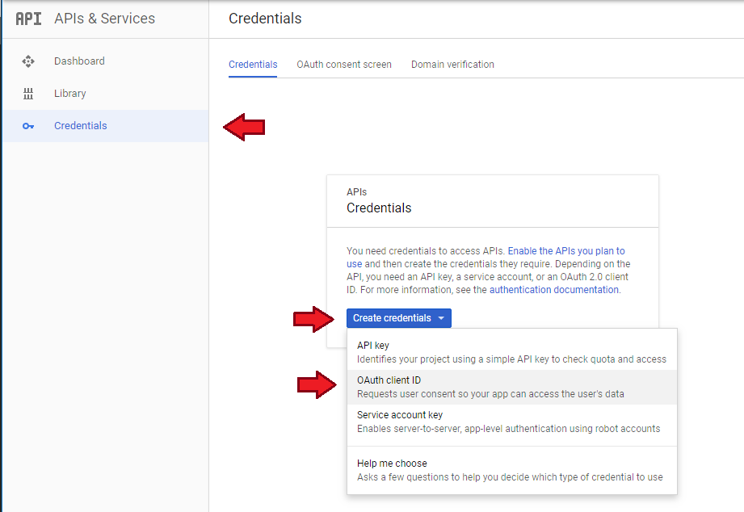
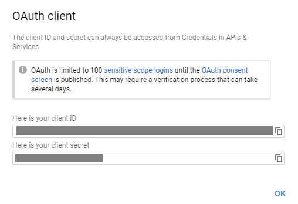

# Local Authentication
You've arrived here because you'd like to use your own client ID and client secret to authenticate the add-on with Google Drive.  I'll caution that this is a very detailed and complicated process geared more toward developers than end users, so if you'd like to do it the easy way, go back to your add-on (typically http://hassio.local:8123/hassio/ingress/hassio_google_drive_backup) and click the "Authenticate with Google Drive" button.  These instructions will have you create a project on Google's Developer Cloud console, generate your own credentials, and use them to authenticate with Google Drive.  You can expect this to take about 15 minutes.  Typically this is what would be done by a developer when releasing a project that serveral users would use, but in this case you will be the only user.  This workflow is for you if:
* You'd like to avoid having your account's credentials go through a server maintained by me.  The typical authentication workflow never sees your Google account password, but it does recieve a token from Google that, if I were malicious, I could use to see the snapshots you've backed up to Drive.  I don't store this token anywhere and instead just pass it back to you, but becase of how Google oauth tokens are generated there is no way you could verify that.  I tip my tinfoil hat to yours and respect your desire to protect your personal information :)
* The typical authentication flow didn't work.  This may be because of a bug, or because the server I set up to handle it is down or broken.  Its just me back here providing this as a free service to the community, so applogogies if things fall into disrepair.

These instructions are current as of Feb 2020.  If you do this and notice they're out of date, Please file an issue on this projects issue page so I can be made aware of it.  Thanks!

## Step 1 - Create a Google Cloud Project
* Go to http://console.developers.google.com and log in with your Google account.
* Click "Select Project" on the top left.
* Click "New Project" to create a project.
* Give the project any name you like, and click "Create Project"

## Step 2 - Enable the Drive API
With your project now created:
* Go to https://console.developers.google.com/apis/library
* Search for "Google Drive API", and click "Enable"

## Step 3 - Create a Consent Screen
Before creating credentials, you'll need to create a consent screen.  Normally this is what people would see when they request to allow your new application to access their Google Drive, but because you're creating it just for yourself, this is just a formality.
* Go back to http://console.developers.google.com and ensure the project name you created earlier is displayed in the upper left.
* Click "OAuth Consent Screen", and fill in **Applicaiton Name** with anything you like.
* Click **Add Scope**, the the dialog that pops up  check the box for "../auth/drive.file" and then click "Add".  This part is very important since it gives the credentials we're about to create permission to see files in Google Drive.  If you don't see this in the dialog that comes up, ensure you enabled the Drive API in the previous step.
* You can leave the rest of this form blank, just click **Save** at the bottom.

## Step 4 - Create Credentials
Now you've set up everything necessary to actually create credentials.
* From http://console.developers.google.com, click "Credentials" at the top of the screen, and then click the "Create Credentials" button.
* Select "OAuth client ID" form the drop down.

## Step 5 - Select Credentials Type
This should have opened a dialog titled "Create OAuth client ID".
* Select "Other" for **Application Type**
* Give the credentials a **Name**, anything will do.
* Click "Create"

## Step 6 - Copy your credentials
This should have opened a new dialog with your generated client ID and client secret.  Take these back to the Add-on, and paste them into the appropriate fields of the add-on web, and follow the instructions from there.

