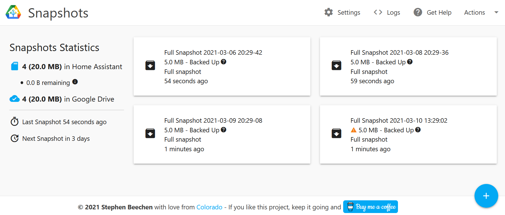
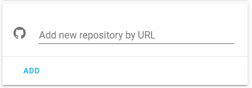
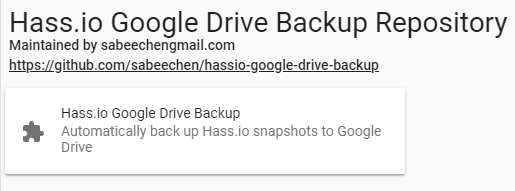
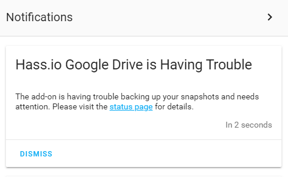
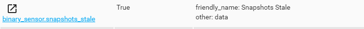

# Hass.io Google Drive Backup

## About
A complete and easy to configure solution for backing up your snapshots to Google Drive
* Automatically creates new snapshots on a configurable schedule.
* Automatically uploads snapshot to Drive, even the ones it didn't create.
* Automatically cleans up old snapshots in Home Assistant and Google drive so you don't run out of space.
* Lets you upload snapshots directly from Google Drive, which makes [restoring from a fresh install](#how-do-i-restore-a-snapshot) very easy.
* Integrates with Home Assistant Notifications, and provides sensors you can trigger off of.
* Simple UI focused on clarity, usability and getting out of the way.  

This is for you if you want to quickly set up a backup strategy without much fuss.  It doesn't require much familiarity with Hass.io, its architectire, or Google Drive.  Detailed install instrctions are provided below but you can just add the repo, click install and open the Web UI.  It will tell you what to do and only takes a few simple clicks.

Do you like this?  Give me a reason to keep doing it and [](https://www.buymeacoffee.com/sabeechen)

## Installation
The add-on is installed like any other.
1.   Go to "Hass.io" > "Add-on" in Home Assistant and add this repository URL: [https://github.com/sabeechen/hassio-google-drive-backup](https://github.com/sabeechen/hassio-google-drive-backup)
  
     
2.   Scroll down the page to find the new repository, and click the new add-on named "Hass.io Google Drive Backup"

     
3.   Click "Install" and give it a few minutes to finish downloading.
4.   Click "Start", give it a few seconds to spin up, and then click the "Open Web UI" button that appears.  For the majority of people this should take you to [https://hassio.local:1627/](https://hassio.local:1627/).
5.   The "Getting Started" page will tell you how many snapshots you have and what it will do with them once you connect it to Google Drive.  You can click "Settings" to change those options throught he add-on (takes effect immediately), or update them from the page where you installed the add-on as shown below (restart for them to take effect).
6.   Click the "Authenticate with Drive" button to link the add-on with your Google Drive account.  Alternatively, you can generate your [own Google API credentials](#can-i-use-my-own-google-api-information-to-authenticate-instead-of-yours), though the process is not simple.
7.   You should be redirected automatically to the backup status page.  Here you can make a new snapshot, see the progress of uploading to Google Drive, etc.  You're done!

## Configuration Options
Settings can be change easily by starting the add-on and clicking "Settings" in the web UI.  The UI explains what each setting is and you don't need to modify anything before clicking "start".  If you  would still prefer to modify the settings in json, the options are detailed below.
*  **max_snapshots_in_hassio** (default: 4): The number of snapshots the add-on will allow Hass.io to store locally before old ones are deleted.
    > #### Example: Keep 10 snapshots in Hass.io
    > ```json
    > "max_snapshots_in_hassio": "10"
    > ```

*  **max_snapshots_in_google_drive** (default: 4): The number of snapshots the add-on will keep in Google Drive before old ones are deleted.  Google Drive gives you 15GB of free storage (at the time of writing) so plan accordingly if you know how big your snapshots are.
    > #### Example: Keep 10 snapshots in Google Drive
    > ```json
    > "max_snapshots_in_google_drive": "10"
    > ```

*  **days_between_snapshots** (default: 3): THow often a new snapshot should be scheduled, eg "1" for daily and "7" for weekly.
    > #### Example: Keep 10 snapshots in Google Drive
    > ```json
    > "days_between_snapshots": "3"
    > ```

*  **snapshot_time_of_day** (default: None): The time of day (local time) that new snapshots should be created in 24 hour "HH:MM" format.  When not specified (the default), snapshots are created at the same time of day of the most recent snapshot.
    > #### Example: Create snapshots at 1:30pm
    > ```json
    > "snapshot_time_of_day": "13:30"
    > ```

*  **specify_snapshot_folder** (default: False): When true, you must select the folder in Google Drive where snapshots are stored.  Once you turn this on, restart the add-on and visit the web-ui to be prompted to select the snapshot folder.
    > #### Example: Specify the snapshot folder.
    > ```json
    > "specify_snapshot_folder": true
    > ```

*  **background_color** and **accent_color**: The background and accent colors for the web UI.  You can use this to make the UI fit in with whatever color scheme you use in Home Assistant.  When unset, the interface matches Home Assistant's default blue/white style.
    > #### Example: Use a dark and red theme
    > ```json
    > "background_color": "#242424"
    > "accent_color": "#7D0034"
    > ```

*   **snapshot_stale_minutes** (default: 180):  How long to wait after a snapshot should have been created to consider snapshots stale and in need of attention.  Setting this too low can cause you to be notified of transient errors, ie the internet, Google Drive, or Home Assistant being offline briefly.
    > #### Example: Notify after 12 hours of staleness
    > ```json
    > "snapshot_stale_minutes": "500"
    > ```
*   **snapshot_password** (default: None):  When set, snapshots are created witha password.  You can use a value from your secrets.yaml by prefixing the password with "!secret". You'll need to remember this password when restoring snapshots.
    > #### Example: Use a password for snapshot archives
    > ```json
    > "snapshot_password": "super_secret"
    > ```
    > #### Example: Use a password from secrets.yaml
    > ```json
    > "snapshot_password": "!secret snapshot_password"
    > ```
*   **snapshot_name** (default: "{type} Snapshot {year}-{month}-{day} {hr24}:{min}:{sec}"):  Sets the name for new snapshots.  Variable parameters of the form "{variable_name}" can be used to modify the name to your liking.  A list of available variables are given [here](#can-i-give-snapshots-a-different-name).
    > #### Example: Create snapshot names like 'Full Snapshot HA 0.92.0'
    > ```json
    > "snapshot_name": "{type} Snapshot {version_ha}"
    > ```
*   **send_error_reports** (default: False):  When true, the text of unexpected errors will be sent to database maintained by the developer.  This helps idenfity problems with new releases and provide better context messages when errors come up.
    > #### Example: Allow sending error reports
    > ```json
    > "send_error_reports": true
    > ```
*   **UI Server Options** The UI is exposed through a webserver on port 1627, which you can map to an externally visible port from the add-on "Network" panel, which also defaults to port 1627.  You can configure a few more options to add SSL or require your Home assistant username/password.  In a future release, the add-on will support [ingress](https://www.home-assistant.io/blog/2019/04/15/hassio-ingress/) but for now it is disabled for compatibility reasons (see [this issue](https://github.com/sabeechen/hassio-google-drive-backup/issues/19)).
    *   **require_login** (default: false): When true, requires your home assistant username and password to access the Web UI.
        > #### Example: Don't require login
        > ```json
        > "require_login": false
        > ```
    * **use_ssl** (default: false): determines if the add-on's webpage should only expose its interface over ssl.  If you use the [Duck DNS Add-on](https://www.home-assistant.io/addons/duckdns/) with the default settings then `"use_ssl": true` setting this to true should just work, if not [see below](#configuration-options).
    *   **certfile** (default: /ssl/certfile.pem): The path to your ssl keyfile
    *   **keyfile** (default: /ssl/keyfile.pem): the path to your ssl certfile
        > #### Example: Use certs you keep in a weird place
        > ```json
        >   "certfile": "/ssl/weird/path/cert.pem",
        >   "keyfile": "/ssl/weird/path/key.pem"
        > ```
*   **verbose** (default: false): If true, enable additional debug logging.  Useful if you start seeing errors and need to file a bug with me.
    > #### Example: Turn on verbose logging
    > ```json
    > `"verbose": true`
    > ```
*   **generational_*** (default: None): When set, older snapshots will be kept longer using a [generational backup scheme](https://en.wikipedia.org/wiki/Backup_rotation_scheme). See the [question below](#can-i-keep-older-backups-for-longer) for configuration options.
    > #### Example: Keep a snapshot once every day 3 days and once a week for 4 weeks
    > ```json
    >   "generational_days": 3,
    >   "generational_weeks": 4
    > ```
*   **exclude_folders** (default: None): When set, excludes the comma separated list of folders by creating a partial snapshot.
*   **exclude_addons** (default: None): When set, excludes the comma separated list of addons by creating a partial snapshot.
    > #### Example: Create partial snapshots with no folders and no configurator add-on
    > ```json
    >   "exclude_folders": "homeassistant,ssl,share,addons/local",
    >   "exclude_addons": "core_configurator"
    > ```
        Note: folders and add-ons must be identified by their 'slug' name.  Its recommended to use the "Settings" dialog within the add-on web UI to configure partial snapshots since these names are esoteric and hard to find.
*   **enable_snapshot_stale_sensor** (default: true): When false, the add-on will not publish the [binary_sensor.snapshots](#how-will-i-know-this-will-be-there-when-i-need-it) stale sensor.
*   **enable_snapshot_state_sensor** (default: true): When false, the add-on will not publish the [sensor.snapshot_state](#how-will-i-know-this-will-be-there-when-i-need-it)  sensor.
*   **notify_for_stale_snapshots** (default: true): When false, the add-on will send a [persistent notification](#how-will-i-know-this-will-be-there-when-i-need-it) in Home Assistant when snapshots are stale.
    > #### Example: Turn off notifications and staleness sensor
    > ```json
    >   "enable_snapshot_stale_sensor": false,
    >   "enable_snapshot_state_sensor": false,
    >   "notify_for_stale_snapshots": false
    > ```

## FAQ
### How will I know this will be there when I need it?
Home Assistant is notorious for failing silently, and your backups aren't something you want to find is broken after an erroneous comma makes you unable to turn on any of the lights in your house.  Thats why I've added some functionality to keep you informed if things start to break.  If the add-on runs into trouble and gets more than 12 hours behind its schedule, you'll know in two ways:
* Notifications in Home Assistant UI

  

* A [binary_sensor](#lovelace-card) you can use to trigger additional actions.
  
   

Redundancy is the foundation of reliability.  With local snapshots, Google Drive's backups, and two flavors of notification I think you're covered.

### How do I restore a snapshot?
If you can still get to the addon's web-UI then can select "Actions" -> "Upload" from any snapshot to have it copied back into Home Assistant. If not, you'll need to start up a fresh installation of Hass.io and do the following:  can be copied over to your Home Assistant "/backups" folder like any snapshot, however because I found this tedious to do on a fresh install of Home Assistant I've made a workflow thats a little easier.  On your fresh install of Hass.io:
*  [Install the add-on.](#installation)  Once linked with Google Drive, you should see the snapshots you created previously show up.  You should see a warning pop up about fidning an "Existing snapshot folder" which is expected, you cna just ignore it for now.
* Click "Actions" -> "Upload" on the snapshot you want to use which will upload the snapshot to Home Assistant directly from Google Drive.  Wait for the upload to finish.
* Click "Actions" -> "Restore" to be taken to the Hass.io restore page, or just navigate there through the Home Assistant interface ("Hass.io" -> "Snapshots").
* You'll see the snapshot you uploaded.  Click on it and select "Wipe & Restore".  Wait a while for it to complete (maybe a logn while).  Congrats! you're back up and running.

Note: You can also just copy a snapshots manually from Google Drive to your /backup folder using something like the Sambda addon.  I've found the steps above to be a little easier, since it works for any operating system, network setup, etc.

### I never look at HA notifications.  Can I show information about backups in my Home Assistant Interface?
The add-on creates a few sensors that show the status of snapshots that you could trigger automations off of.  `binary_sensor.snapshots_stale` becomes true when the add-on has trouble backing up or creating snapshots.  For example the lovelace card below only shows up in the UI when snapshots go stale:
#### Lovelace Card

    type: conditional
    conditions:
      - entity: binary_sensor.snapshots_stale
        state_not: 'False'
    card:
      type: markdown
      content: >-
        Snapshots are stale! Please visit the "Hass.io Google Drive Backup" add-on
        status page for details.
      title: Stale Snapshots!`
#### Mobile Notifications
If you have [android](https://github.com/Crewski/HANotify) or [iOS](https://www.home-assistant.io/docs/ecosystem/ios/), [other notifications](https://www.home-assistant.io/components/notify/) set up, this automation would let you know if things go stale:


    - alias: Snapshots went stale
      id: 'snapshots_went_stale'
      trigger:
      - platform: state
        entity_id: binary_sensor.snapshots_stale
        from: 'False'
        to: 'True'
      condition: []
      action:
      - data:
        service: notify.android
          title: Snapshots are Stale
          message: Please visit the 'Hass.io Google Drive Backup ' add-on status page
            for details.

You could automate anything off of this binary sensor.  The add-on also exposes a sensor `sensor.snapshot_backup` that exposes the details of each snapshot.  I'm working on a custom lovelace component to expose that information.

### Can I specify what time of day snapshots should be created?
You can add `"snapshot_time_of_day": "13:00"` to your add-on configuration to make snapshots always happen at 1pm.  Specify the time in 24 hour format of `"HH:MM"`.  When unspecified, the next snapshot will be created at the same time of day as the last one.

### Can I keep older backups for longer?
>This is just an overview of how to keep older snapshots longer.  [See here](https://github.com/sabeechen/hassio-google-drive-backup/blob/master/hassio-google-drive-backup/GENERATIONAL_BACKUP.md) for a more in-depth explanation.

The add-on can be configured to keep [generational backups](https://en.wikipedia.org/wiki/Backup_rotation_scheme) on daily, weekly, monthly, and yearly intervals instead of just deleting the oldest snapshot.  This can be useful if, for example, you've made an erroneous change but haven't noticed for several days and all the backups before the change are gone.  With a configuration setting like this...
```json
  "generational_days": 3,
  "generational_weeks": 4,
  "generational_months": 12,
  "generational_years": 5
 ```
 ... a snapshot will be kept for the last 3 days, the last 4 weeks, the last 12 months, and the last 5 years.  Additionally you may configure the day of the week, day of the month, and day of the year that weekly, monthly, and yearly snapshots are maintained.
  ```json
    "generational_days": 3,
    
    "generational_weeks": 4,
    "generational_day_of_week": "mon",  // Can be 'mon', 'tue', 'wed', 'thu', 'fri', 'sat' or 'sun' (defaults to 'mon')

    "generational_months": 12,
    "generational_day_of_month": 1, // Can be 1 through 31 (defaults to 1) 

    "generational_years": 5,
    "generational_day_of_year": 1, // can be 1 through 365 (defaults to 1)
 ```
 * Any combination of days, weeks, months, and years can be used.  They all default to 0.
 * Its highly reccommended to set '`"days_between_snapshots": 1`' to ensure a snapshot is available for each day.
 * Ensure you've set `max_snapshots_in_drive` appropriatly high to keep enough snapshots (24 in the example above).
 * Once this option is enabled, it may take several days or weeks to see older snapshots get cleaned up.  Old snapshots will only get deleted when the number present exceeds `max_snapshots_in_drive` or `max_snapshots_in_hassio`
 
### I already have something that creates snapshots on a schedule.  Can I use this just to backup to Google Drive?
If you set '`"days_between_snapshots": 0`', then the add-on won't try to create new snapshots but will still back up any it finds to Google Drive and clean up old snapshots in both Home Assistant and Google Drive.  This can be useful if you already  have for example an automation that creates snapshots on a schedule.

### Can I give snapshots a different name?
The config option `snapshot_name` can be changed to give snapshots a different name or with a date format of your choosing.  The default is `{type} Snapshot {year}-{month}-{day} {hr24}:{min}:{sec}`, which makes snapshots with a name like `Full Snapshot 2019-10-31 14:00:00`.  Using the settings menu in the Web UI, you can see a preview of what a snapshot name will look like but you cna also set it in the add-on's options.  Below is the list of variables you can add to modify the name to your liking.
* `{type}`: The type of snapshot, either 'Full' or 'Partial'
* `{year}`: Year in 4 digit format (eg 2019)
* `{year_short}`: Year in 4 digit format (eg 19)
* `{weekday}`: Long day of the week (eg Monday, ..., Sunday)
* `{weekday_short}`: Short day of week (eg Mon, ... Sun)
* `{month}`: 2 digit month (eg 01, ... 12)
* `{month_long}`: Month long name (January, ... , December)
* `{month_short}`: Month long name (Jan, ... , Dec)
* `{ms}`: Milliseconds (001, ..., 999)
* `{day}`: Day of the month (01, ..., 31)
* `{hr24}`: 2 digit hour of the day (0, ..., 24)
* `{hr12}`: 2 digit hour of the day (0, ..., 12)
* `{min}`: 2 digit minute of the hour (0, ..., 59)
* `{sec}`: 2 digit second of the minute (0, ..., 59)
* `{ampm}`: am or pm, depending on the time of day
* `{version_ha}`, Home Assistant version string (eg 0.91.3)
* `{version_hassos}`: HassOS version string (eg 0.2.15)
* `{version_super}`: , Supervisor version string (eg 1.2.19)
* `{date}`: Locale aware date (eg 2019/01/01).
* `{time}`: Locale aware time (eg 02:03:04 am)
* `{datetime}`: Locale-aware datetime string
* `{isotime}`: Date and time in ISO format 
* `{hostname}`: The Home Assistant machine's hostname 


### Will this ever upload to Dropbox/FTP/SMB/MyFavoriteProtocol?
Most likely no.  I started this project to solve a specific problem I had, storing snapshot in a redundant cloud provider without having to write a bunch of buggy logic and automations.  I don't have the personal bandwidth available to make this work well with other storage providers.

### But Google reads my emails!
Maybe.  You can encrypt your snapshots by giving a password in the add-on's options.

### Does this store any personal information?
On a matter of principle, I only keep track of and store information necessary for the add-on to function.  To the best of my knowledge the scope of this is:
* You can opt-in to sending error reports from the add-on sent to a database maintained by me.  This includes the full text of the error's stack trace, the error message, and the version of the add-on you're running.  This helps notice problems with new releases but leaving it off (the default unless you turn it on) doesn't affect the functionality of the add-on in any way.
* Once authenticated with Google, your Google credentials are only stored locally on your Home Assistant instance.  This isn't your actual username and password, only an opaque token returned from Google used to verify that you previously gave the Add-on permission to access your Google Drive.  Your password is never seen by me or the add-on.  You can read mroe abotu how authentication with Google is accomplished [here](https://github.com/sabeechen/hassio-google-drive-backup/blob/master/hassio-google-drive-backup/AUTHENTICATION.md).
* The add-on has access to the files in Google Drive it created, which is the 'Hass.io Snapshots' folder and any snapshots it uploads.  See the https://www.googleapis.com/auth/drive.file scope in the [Drive REST API v3 Documentation](https://developers.google.com/drive/api/v3/about-auth) for details, this is the only scope the add-on requests for your account.
* Google stores a history of information about the number of requests, number of errors, and latency of requests made by this Add-on and makes a graph of that visible to me.  This is needed because Google only gives me a certain quota for requests shared between all users of the add-on, so I need to be aware if someone is abusing it.
* The Add-on is distributed as a Docker container hosted on Docker Hub, which his how almost all add-ons work.  Docker keeps track of how many people have requested an image and makes that information publicly visible.

This invariably means that I have a very limited ability to see how many people are using the add-on or if it is functioning well.  If you do like it, feel free to shoot me an email at [stephen@beechens.com](mailto:stephen@beechens.com) or star this repo on GitHub, it really helps keep me motivated.  If you run into problems or think a new feature would be nice, file an issue on GitHub.

### Can I use my own Google API information to authenticate instead of yours?
On the first "Getting Started" page of the add-on underneath the "Authenticate with Google Drive" button is a link that lets you enter your own `Client Id` and `Client Sercet` to authenticate with Google Drive.  You can get back to that page by going to "Actions" -> "Reauthorize Google Drive" from the add-on's web UI if you've already connected it previously.   Instructions are also provided for those who are unfamiliar with the process, its tedious to complete but ensures the add-on's communication is only between you and Google Drive.

### Can I permanently save a snapshot so it doesn't get cleaned up?
Select "Never Delete" from menu next to a snapshot in the add-on's Web UI.  You can choose to keep it from being deleted in Home Assistant or Google Drive.  When you do this, the snapshots will no lnger count against the maximum number of snapshots allowed in Google Drive or Home Assistant.
Alternatively, you can move a snapshot in Google Drive out of the snapshot folder.  the add-on will ignore any files that aren't in the snapshot folder.  Just don't move them back in accidentally since they'll get "cleaned up" like any old snapshot after a while :)

### What do I do if I've found an error?
If the add-on runs into trouble and can't back up, you should see a big red box with the text of the error on the status webpage.  This should include a link to pre-populate a new issue in github, which I'd encourage you to do.  Additioanlly you can set the add-on config option `"verbose": true` to get information from the add-on's logs to help me with debugging.

### Will this fill up my Google Drive?  Why are my snapshots so big?
You'll need to take care to ensure you don't configure this to blow up your Google Drive.  You might want to consider:
*   If your snapshots are HUGE, its probably because Home Assistant by default keeps a long sensor history.  Consider setting `purge_keep_days: N` in your [recorder confiuration](https://www.home-assistant.io/components/recorder/) to trim it down to something more manageable, like 1 day of history.
*   Some other of the add-ons are designed to manage large amounts of media.  For example, add-ons like the Plex Media Server are designed to store media in the /share folder, and Mobile Upload folders default to a sub-folder in the addons folder.  If you migrate all of your media to the HASS.io folder structure and you don't exclude it from the backup, you _could easily chew up your entire Google Drive space in a single snapshot_.
*   If you use the Google Drive Desktop sync client, you'll porbably want to tell it not to sync this folder (its available in the options).

### I want my snapshots to sync to my Desktop computer too
Thats not a question but you can use [Google Drive Backup & Sync]([https://www.google.com/drive/download/) to download anything in your Google Drive to your desktop/laptop automatically.

### I configured this to only keep 4 snapshots in Drive and Hass.io, but sometimes I can see there are 5?
The add-on will only delete an old snapshot if a new one exists to replace it, so it will create a 5th one before deleting the first.  This is a reliability/disk usage compromise that favors reliability, because otherwise it would have to delete an old snapshot (leaving only 3) before it could guarantee the 4th one exists.

