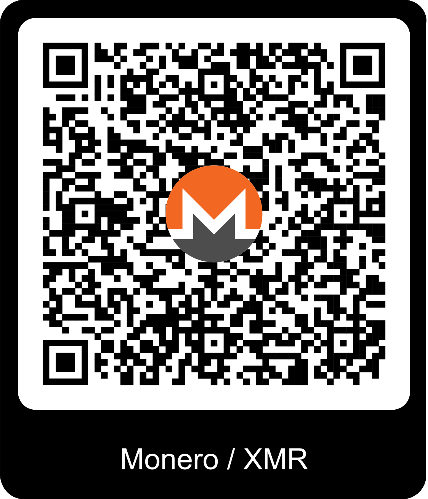
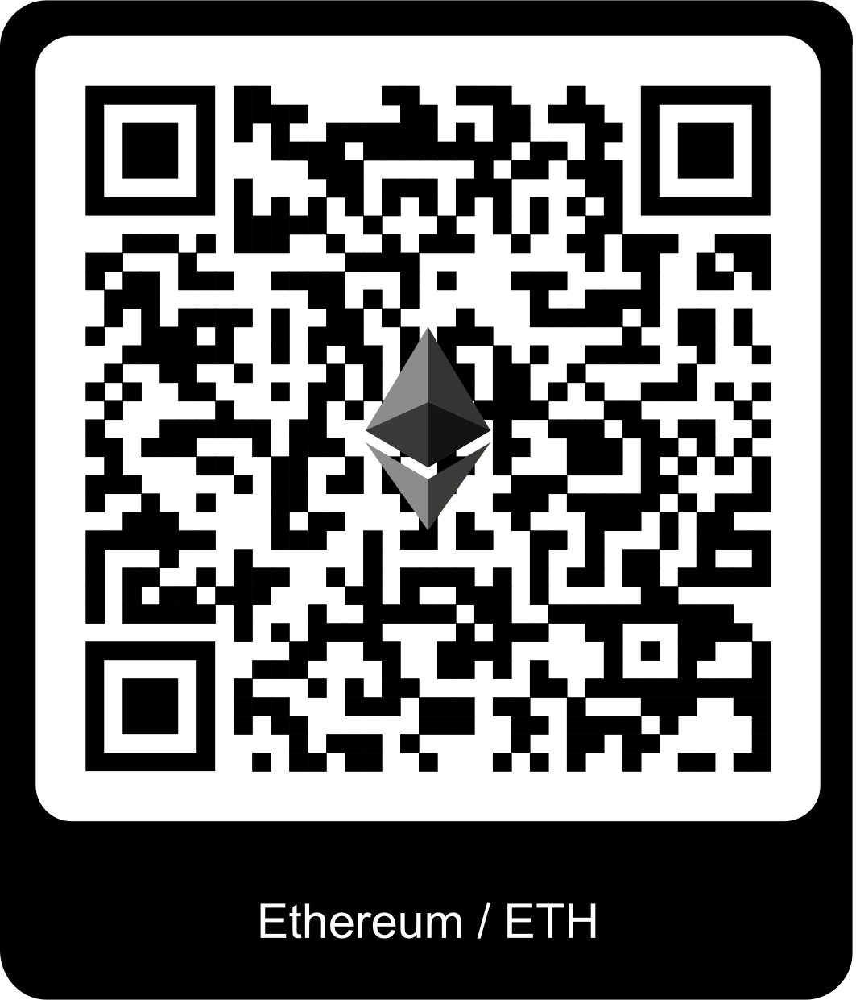
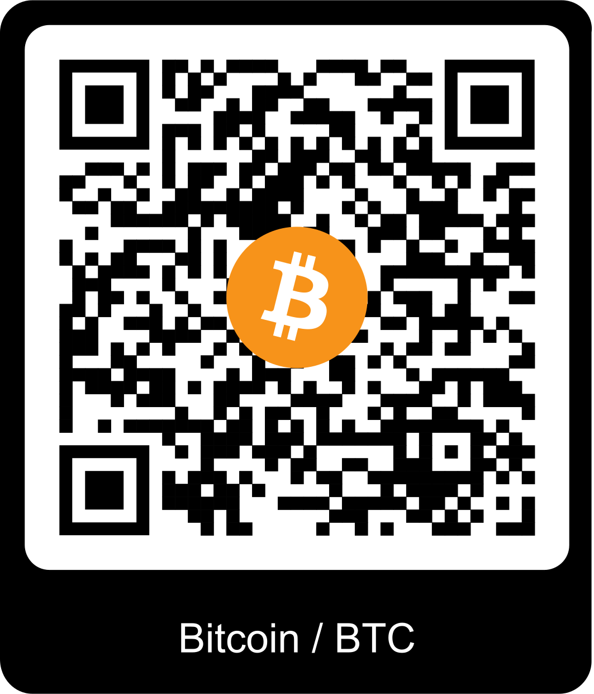

## Contributing with Cryptocurrency
Below are the addresses and relevant QR Codes for contributiong to the project with Monreo, Ethereum and Bitcoin.  Thank you for considering!  If you'd like to donate using a currency not listed, make an [issue](https://github.com/sabeechen/hassio-google-drive-backup/issues) so I can consider it.  Cryptocurrency might be the purest way to contribute, because I have no way of knowing who you are.  Your anonymous support is appreciated <3
<br><br>
### <br>


Monero/XMR Address:
```
8BtRhV9vUNkTDST7WEWuH7JumpvrFApVag5D2fVTLgfdJH8sjiy5LQo68WK4GaLBijTYb7XW6D6bChQGkDeDMmfTTTZGNTr
```

<br><br>
### <br>


Ethereum/ETH Address:
```
0xfa455Bdd245F67Dd1D549C2Ac67EA6BBf91402a7
```


<br><br>
### <br>


Bitcoin/BTC Address:
```
bc1qystpwsqqwusam38mhwafh8n4yln798zqprsl93
```